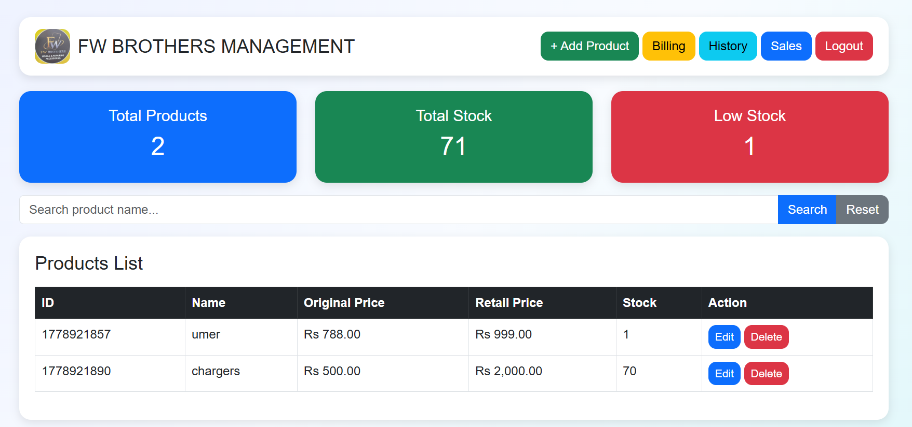

# FW Brothers POS & Inventory Management System

A complete Point of Sale (POS) and Inventory Management System built using **PHP, Bootstrap, HTML, CSS, and JavaScript**. This system helps manage products, stock, billing, sales, and profit tracking in a simple and efficient way.

---

## 🚀 Features

* Product Management (Add / Update / Delete)
* Inventory & Stock Tracking
* Manual Billing System
* Profit Calculation per Sale
* Sales & Revenue Tracking
* Billing History System
* Low Stock Alerts
* Search Products
* Clean and Responsive UI (Bootstrap)

---

## 🛠️ Technologies Used

* PHP (Core PHP - No Framework)
* HTML5
* CSS3
* Bootstrap 5
* JavaScript
* File Handling (TXT-based database system)

---

## 📦 Project Structure

* index.php → Dashboard & product listing
* add_product.php → Add new products
* billing.php → Billing system
* view_bills.php → Billing history
* update_product.php → Update product details
* delete_product.php → Delete product
* products.txt → Product database
* bills.txt → Billing records

  ## 📸 Screenshots

### Dashboard


### Billing System


### History Page


---

## ⚙️ How to Run This Project

1. Install **XAMPP**
2. Move project folder to:

   ```
   C:\xampp\htdocs\
   ```
3. Start **Apache** from XAMPP Control Panel
4. Open browser and run:

   ```
   http://localhost/fw_brothers/
   ```
5. Login system (if included) or start using dashboard

---

## 📊 Project Purpose

This project is built for learning and practical experience in:

* Business management systems
* Inventory control
* POS billing systems
* PHP backend logic
* Real-world project development

---

## 👨‍💻 Developer

Student Developer
Currently learning **Digital Marketing, Business Systems & Web Development**
Focused on building real-world projects for practical experience.

---

## 📌 Future Improvements

* Database integration (MySQL)
* Barcode scanning system
* Invoice PDF generation
* Advanced analytics dashboard
* Multi-user login system

---

## ⭐ If you like this project

Give it a ⭐ on GitHub and feel free to fork or improve it!

